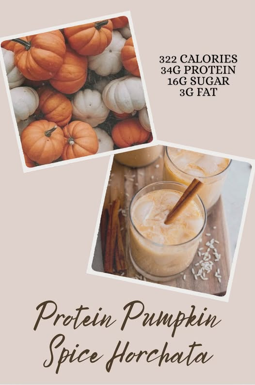
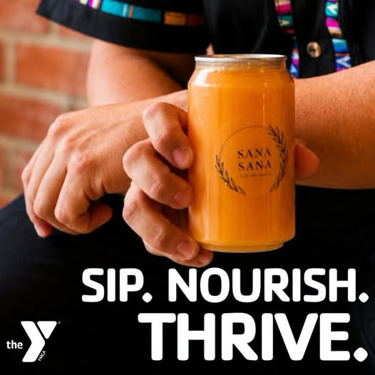
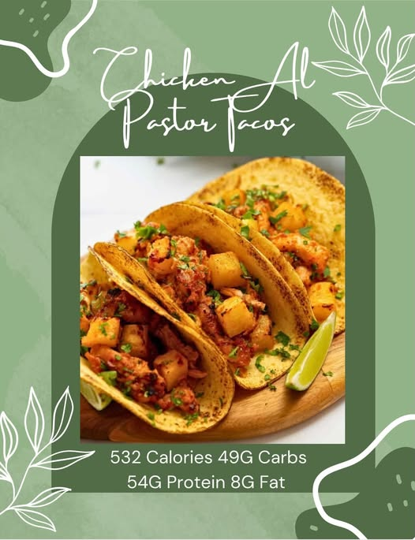
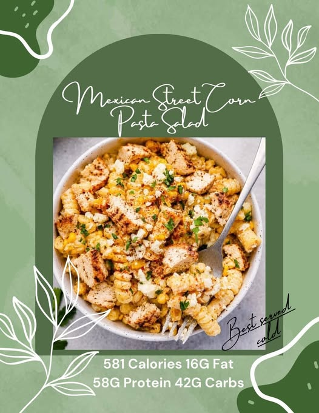
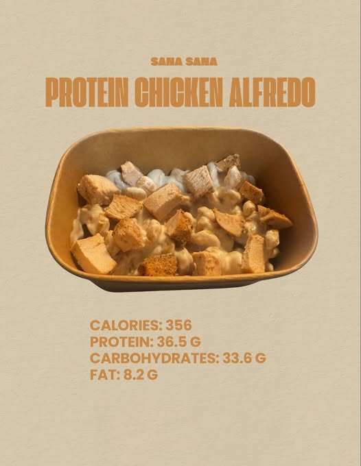

# (20+) Facebook

> ## Excerpt
> Good morning and happy Friday everyone!Unfortunately, our team has fallen under the weather and to avoid getting anyone else sick we have made the decision to wait until next week to restock. Thank you all for your patience and understanding

---
Good morning and happy Friday everyone!

Unfortunately, our team has fallen under the weather and to avoid getting anyone else sick we have made the decision to wait until next week to restock. Thank you all for your patience and understanding

9

1

What is PSL exactly?

Where can I buy ingredients?

2

1

At the YMCA, Healthy Living goes beyond what happens during a workout. It’s about creating a community where healthier choices are accessible, local businesses are supp…

See more

What ingredients are in Sana?

How does Sana benefit workouts?

3

Due to the upcoming Holiday, our schedule will be a bit different. We will be taking this week off from juicing to spend time with our family, however meeting your health goals is still important to us so our meal prep restock will continue as scheduled for Monday 9/7.

Why pause juicing this week?

How keep nutrition without juicing?

10

3

Hitting this weeks meal prep restock is our Chicken Al Pastor Tacos served with a side of rice and our home made salsa verde 

Ll…

See more

2

1

Our first meal prep option for this week is our Mexican Street Corn Pasta Salad  packed with protein so you can still enjoy those meals that feel like home  …

See more

How much protein per serving?

What’s the carb count?

4

2

2

by author

wait need this as soon as physically possible

-   Reply
    

Author

-   Reply
    

Our second meal prep for tomorrow for those who want to keep eating the comfort food they love while still hitting their goals 

How many calories per serving?

Can I freeze this meal?

4

1

