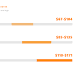

# freelance full stack web app rates

> ## Excerpt
> You said: freelance full stack web app rates

---
You said: freelance full stack web app rates

### AI Mode reply for freelance full stack web app rates

Freelance full-stack web application rates generally range from **$25 to $150+ per hour**, while fixed-price web app projects typically cost between **$10,000 and $100,000+** depending on complexity, developer location, and experience.

___

💰 Rates by Hourly & Location Breakdowns

A developer's location is the largest factor driving variations in hourly pricing:

## Shared

0 files

-   Second Talent
    
    Cost to Hire Freelance Full-Stack Developer: $85-$135/hr | 2026
    
    Sep 8, 2026 — A mid-level freelance or contract full-stack developer in the United States costs $85 to $135 an hour, before the payroll, insuran...
    
    
    
-   contus.com
    
    Cost of Hiring a Full Stack Developer: Hourly Rate in 2026
    
    
